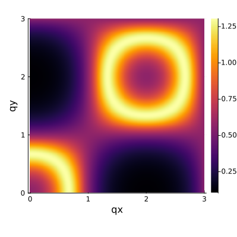

# JuliaSCGA.jl
JuliaSCGA.jl is a Julia package that implements the self-consistent Gaussian approximation (SCGA) method. Starting from a general spin Hamiltonian of isotropic or anisotropic exchange interactions and single-ion anisotropy, the SCGA method calculates the spin-spin correlations in the designated reciprocal space. Compared to other methods like the classical Monte Carlo simulations, the SCGA method provides an efficient way to analyze the diffuse neutron scattering data, which can be utilized to determine the spin Hamiltonian through fits to the experimental data using optimization packages like [Optim.jl](https://github.com/JuliaNLSolvers/Optim.jl/).

## Installation
To install JuliaSCGA.jl, type the following command in the Julia REPL:
```julia
] add https://github.com/moon-dust/JuliaSCGA.jl
```

## Model definition
In JuliaSCGA.jl, the definition of the [UnitCell](src/UnitCell.jl), including the [InteractionMatrix](src/InteractionMatrix.jl), inherits from [SpinMC.jl](https://github.com/fbuessen/SpinMC.jl). As shown in the example, the *J<sub>1</sub>-J<sub>2</sub>* model on a diamond lattice can be defined as:

```julia
using JuliaSCGA

# define the basis vectors of the primitive cell
a1 = (7.5095, 0.0000, 0.0000) 
a2 = (3.7547, 6.5034, 0.0000) 
a3 = (3.7547, 2.1678, 6.1315) 
uc = UnitCell(a1,a2,a3) 

# add atom positions
b1 = addBasisSite!(uc, (1.8774, 1.0839, 0.7664)) 
b2 = addBasisSite!(uc, (13.1416, 7.5873, 5.3650)) 

# define coupling matrices and apply to the bonds
J1 = [1.00 0.00 0.00; 0.00 1.00 0.00; 0.00 0.00 1.00]*-1.00 
J2 = [1.00 0.00 0.00; 0.00 1.00 0.00; 0.00 0.00 1.00]* 0.25

addInteraction!(uc, b2, b1, J1, (1, 1, 0)) 
addInteraction!(uc, b2, b1, J1, (1, 0, 1)) 
addInteraction!(uc, b2, b1, J1, (0, 1, 1)) 
addInteraction!(uc, b2, b1, J1, (1, 1, 1)) 
addInteraction!(uc, b1, b1, J2, (1, -1, 0)) 
addInteraction!(uc, b1, b1, J2, (0, -1, 1)) 
addInteraction!(uc, b2, b2, J2, (1, -1, 0)) 
addInteraction!(uc, b2, b2, J2, (0, -1, 1)) 
addInteraction!(uc, b1, b1, J2, (1, 0, -1)) 
addInteraction!(uc, b2, b2, J2, (1, 0, -1)) 
addInteraction!(uc, b1, b1, J2, (1, 0, 0)) 
addInteraction!(uc, b1, b1, J2, (0, 1, 0)) 
addInteraction!(uc, b1, b1, J2, (0, 0, 1)) 
addInteraction!(uc, b2, b2, J2, (1, 0, 0)) 
addInteraction!(uc, b2, b2, J2, (0, 1, 0)) 
addInteraction!(uc, b2, b2, J2, (0, 0, 1)) 
```
The current version of JuliaSCGA.jl (0.1.2) only works for 3-dimensional lattices. For 2-dimensional lattices like the triangular lattice, please consider adding a third basis vector that is perpendicular to the 2D lattice and applying no interlayer couplings.
## Calculation
Define the *k* points in reciprocal space of the primary cell where the spin-spin correlation will be calculated:
```julia
# calculate the spin correlations in the (hk0) plane, defined in the cubic cell
k_grid = [0:0.005:3;]
qx = [x_grid for x_grid in k_grid, y_grid in k_grid]
qy = [y_grid for x_grid in k_grid, y_grid in k_grid]
q_calc = [vec(qx) vec(qy) zeros(length(qx))]

# transfer to the primitive cell
qmat = [1/2 1/2 0; 0 1/2 1/2; 1/2 0 1/2]
q_crys = qmat*q_calc'
q_crys = q_crys'*1.0
```

Before calculating the spin correlations, the bonding vectors among the spins are stored for efficiency:
```julia
# generate the bonding distance vector as a N*3 matrix
dist = getDist(uc)
```

The interaction matrix for the *k* points of interest are calculated and stored:
```julia
# calculate the interaction matrix
Jq_calc = getFourier_iso(uc, dist, q_crys)
```

A self-consistent calculation is obtained to obtain the Lagrange multiplier $\lambda$ at reverse temperature $\beta$:
```julia
# solve lambda
β = 2.0
λ = solveLambda_iso(uc, beta)
```
Finally, calculate the spin correlation function and plot the results:
```julia
correl = getCorr_iso(uc, Jq_calc, β, λ)

using Plots
gr()
heatmap(qx[:,1], qy[1,:], reshape(correl, axes(qx)), xlabel="qx", ylabel="qy", aspect_ratio=1, size=(400,400))
```

For the example diamond lattice code with *J<sub>1</sub>* = -1 and *J<sub>2</sub>* = 0.25, the calculated diffuse pattern looks like this:



## Multi-Threading
JuliaSCGA.jl supports the [Multi-Threading](https://docs.julialang.org/en/v1/manual/multi-threading/) option to speed up the calculation. To activate this option, following this [page](https://stackoverflow.com/questions/71596187/changing-threads-in-settings-json-of-vs-code-for-julias-jupyter-notebooks) to set the number of threads in VS code.


